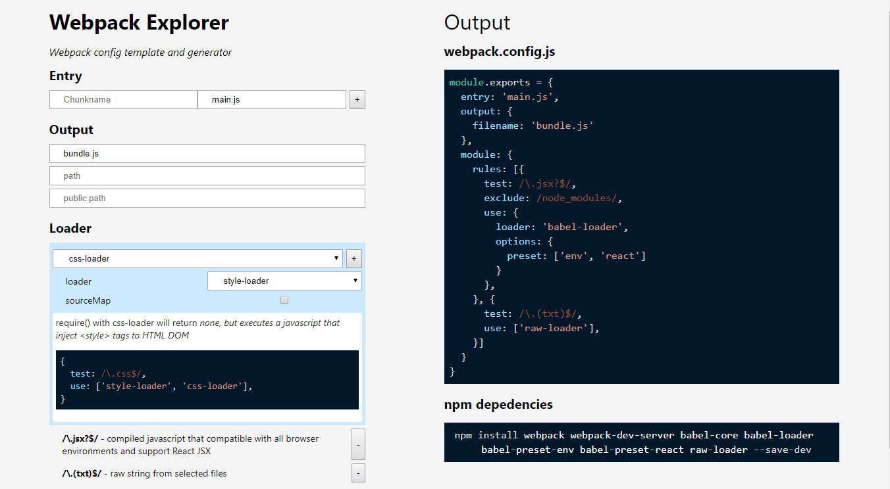

# Webpack Explorer

At first I was scared with how difficult to setup a project with webpack in it, so much that I'd think to just move on and forget about it. But soon after this project is started, things change.

This is my first project running with webpack. **[Open it right in your browser now](https://wilnode.github.com/webpack-explorer)**.

At first look it may look very simple, then try to add some loaders and see if it changes your mind.

## Preamble

Building Javascript with webpack is optional. If you happen to happily use [Codepen](https://codepen.io) and somehow your code get too large and burden and wishing to split it, Webpack might be right tool. Otherwise stick with the easy one 😉

#### Alpha Stage

Yes, this is a fresh new hot spaghetti project and a lot ingredients are missing. If the generated config or the explanation in the website doesn't feel good for you please slap me with [issues](https://github.com/willnode/webpack-explorer/issues).

## How To Use

First figure what frameworks and tools that your project will use. Babel? Jsx? Sass? Typescript? Vue? I got you covered. Just pick what necessary.



#### Get a new project

On the right side, you'll be served with two things: the `webpack.config.js` and its `npm depedencies`.

First on new empty folder, open a terminal and run:

```
npm init
```

Answer few questions, then when it's done. Install those `npm depedencies`:

```
npm install webpack webpack-dev-server ... ... ... ... --save-dev
```

> Tip: Also add libraries that necessary to your project there.

It might take a while, so lets prepare other stuff, like pasting the contents of `webpack.config.js` to your project:

```js
module.exports = {
    entry: 'main.js',
    output: {
        filename: 'bundle.js'
    }
    /* whatever the webpack.config.js content you have */
}
```
and our `main.js`:
```js
document.write('Hello, World!')
```
and our `index.html`:
```html
<html>
<head>
    <title>My App</title>
</head>
<body>
    <script src="bundle.js"></script>
</body>
</html>
```
> Replace these `main.js` or `bundle.js` if you've change these in your config!

After that, **wait** until it's done. Then add these scripts in your `package.json`:
```json
{
    "scripts": {
        "dev": "webpack-dev-server",
        "build": "webpack",
    }
}
```

That's it! now run `npm run dev` and see your localhost:8080. See the `Hello, World!`? Congratulation 🎉

#### Next Level

Don't forget to try `require()` to other javascript or files that you're set with your loaders. If you want to go big, don't forget to set your source to `src/` and output to `dist/` (or your own convention, its your project anyway!).

---

## Caveat

Webpack is of course, very powerful. Some features (and loaders/plugins) can't get into this demo because it's technically difficult to do (but easy for human). Some other yet important concept (e.g. development vs production mode) is not handled in this project (but you *can* see how this project [handles it](package.json)). Use human creativity to unlock webpack full potential!

One more thing is that, if your project targeting a framework, have a look to its boilerplate. Projects like [create-react-app](https://github.com/facebookincubator/create-react-app) for React and [vue-cli](https://github.com/vuejs/vue-cli) for Vue.js is an excellent boilerplate tool and have preconfigured webpack config out of the box, often packed with many features included. Have a look if you don't do it yet.

## Close Word

This project changes my mind. Everyone who doing javascript in 2018 should give webpack a try!

## Cool Stuff

This project [development](webpack.config.js) vs. [production](webpack.config.prod.js) config. <- Real world example.

[Array Explorer by @sdras](https://github.com/vuejs/vue-cli) <- Not mine, but this is where I got the [inspiration]. Check it out!

[Webpack Docs](https://webpack.js.org/concepts/) <- Impossible to do this project without dangling with documentations.

[Awesome Webpack](https://github.com/webpack-contrib/awesome-webpack) <- Nothing beats the community lists!

[My Twitter](https://twitter.com/willnode) <- ^_^